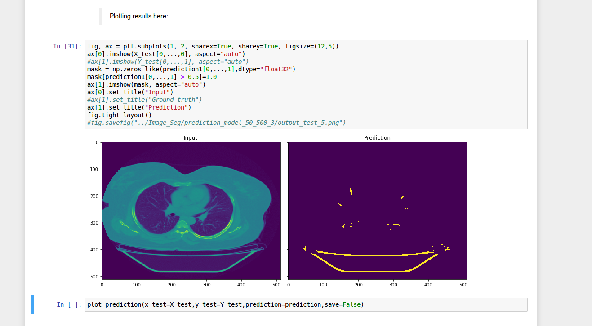

# HealthCare
**Project : Image Segmentation of Dicom Images to remove headrest label from head CT scans**

**Please give a :star: if you like my work.:alien:**

## Description

 - Programming Language - **Python2.7, Jupyter, Tensorflow**
 - Task: Remove Headrest from all the scans of patient given in dicom format using **Convolutional Neural Networks by Image Segmentation**
 
## Data Preprocessing

 - Reading Dicom Images from **[pydicom](https://pypi.python.org/pypi/pydicom)** package and store image in numpy arrays.
 - Converting raw grayscaled images stored in Hounsfield Units into meaningful numpy arrays for CNNs by rescaling them using slope and threshold taken from dicom image header. Below is the example of Hounsfield units histogram representation before scaling of a dicom image.

 Here is the Hounsfield units histogram representation after scaling and threshold correction for the same dicom image.

 - **Creating Ground truth labels** by segmenting images using K-Means clustering and finding non-connected components in a clustered image to identify headrest label.This works with 95%+ accuracy as only few examples are there where headrest is connected directly to head in a CT scan image. Below is one of the example where our method fails and this will be solved by using **CNNs**:

 Segmenting them by calculating mean and standard deviation of HU units for each label created in previous step, this is done because more often some small noisy components of head may also get labelled as headrest which are not connected to head in a CT scan image. Then, we give headrest label pixels as **1** in the image and rest all label pixels as **0** in the image. 
 - Storing these labels as segmented labels for training input images.

## Building CNNs
 - Input Image of 512 * 512 greyscaled images of head CT scans.
 - Output - Segmented label for Headrest
 - Built different models:
   - 3 Layer - 2 Convolutional/Deconvolutional in each layer - 2 Max pooling - "VALID" padding (size not same of output)
   - 7 Layer - 2 Convolutional/Deconvolutional (First 3 layers), 4 (Next 3 layers), 8(Last layer) - 6 pooling and upsampling layers - "SAME" padding (Final model used for predicting images.) Here is the architecture of convolutional neural network model:

 - Performing much better than thresholding methods
 
## Results & Visualization
 - Achieved accuracy above **99%** in Image segmentation of 500 dicom images. Here is one example of one test image.

 - Since model was trained on only head CT scan images, here is the segmented image of chest CT scan image when feeded to the model.

 - **There is an awesome visualization of how model improves and predicts a batch of 10 images per epoch in a video format. Here is the [link](https://github.com/harsh1795/CNN-DICOM-Segmentation/blob/master/images/Epoc_video.mp4) for the video or you can also download it from /images/Epoc_video.mp4** 
   
